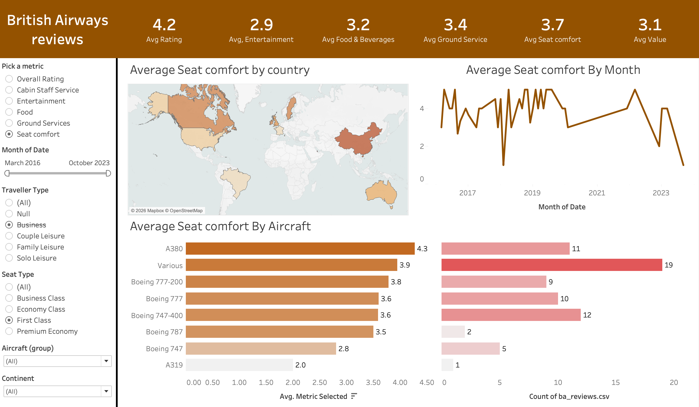
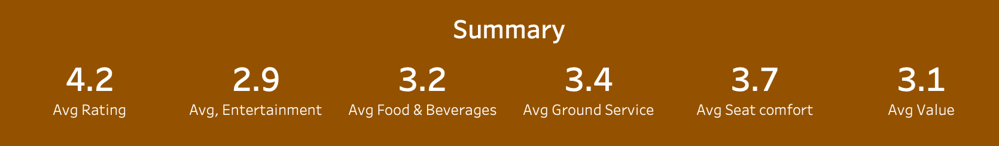
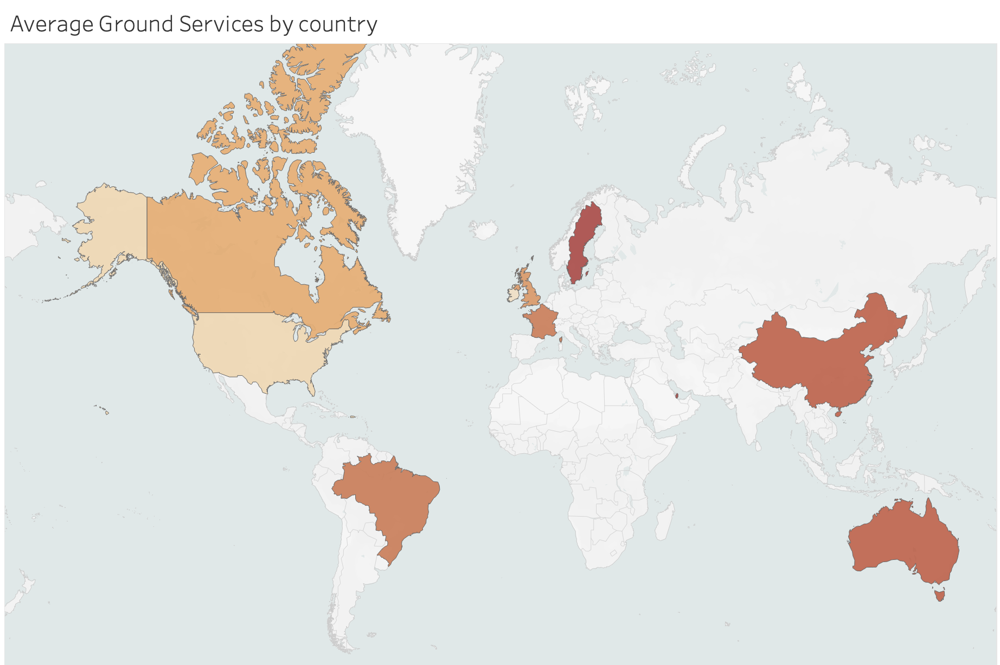
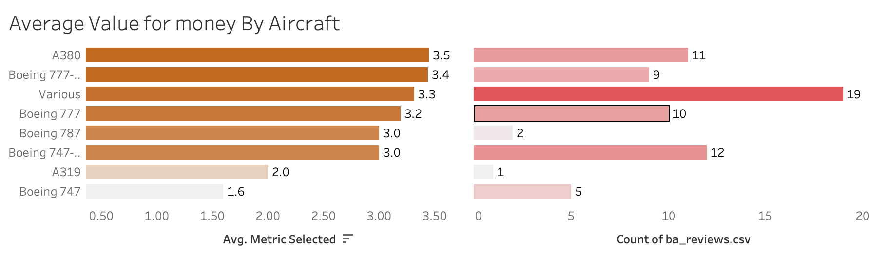
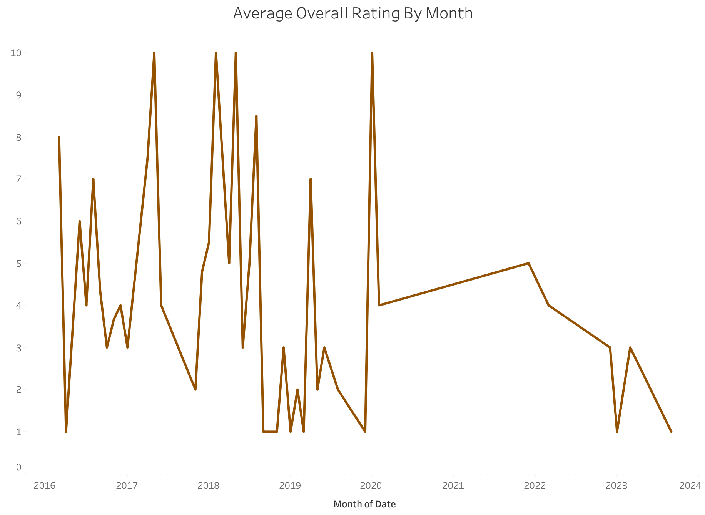

# ✈️ British Airways Review Dashboard

An interactive Tableau dashboard that analyses customer reviews of British Airways, allowing users to explore ratings across key service dimensions, aircraft types, routes, and time periods.

---

## 📸 Dashboard Preview

<!-- Replace the line below with your screenshot:  -->


---

## 📊 Sheets

### 1. Summary

<!-- Replace the line below with your screenshot:  -->


The Summary sheet serves as the at-a-glance overview of the entire dashboard. It displays KPI cards for all seven service metrics — **Overall Rating, Cabin Staff Service, Entertainment, Food & Beverages, Ground Services, Seat Comfort,** and **Value for Money** — as average scores across all reviews. This sheet gives viewers an immediate sense of how British Airways performs overall before diving into any specific dimension or filter.

---

### 2. Map — Average `Ground Services` by Country

<!-- Replace the line below with your screenshot:  -->


The Map sheet plots average ratings geographically, colour-coding each country by the currently selected metric. It uses Tableau's built-in map layer joined against the `Countries.csv` lookup table (which includes continent and region data) to accurately geocode reviewer locations. This view is useful for spotting regional patterns — for example, whether passengers from certain continents consistently rate BA higher or lower than the global average.

---

### 3. Aircraft — Average `Value for money` by Aircraft

<!-- Replace the line below with your screenshot:  -->


The Aircraft sheet breaks down the selected metric by aircraft type using a grouped/binned dimension that consolidates variant spellings and model combinations (e.g., "A320 neo", "A320 Neo", "A320-200" are grouped together). This makes it easy to compare passenger experience across BA's fleet — from the Airbus A380 on long-haul routes to the A319/A320 family on short-haul European services — and identify which aircraft types are most and least well-received.

---

### 4. Month — Average `Overall Rating` by Month

<!-- Replace the line below with your screenshot:  -->


The Month sheet tracks how the selected rating metric has trended over time, plotted by the month the flight was taken (`date_flown`). This view is particularly useful for identifying seasonal patterns, the impact of major operational events (e.g., post-COVID recovery, fleet changes), or gradual shifts in passenger sentiment over the years.

---

## 🎛️ Dynamic Metric Selector

All four sheets respond to a single **"Pick a metric"** parameter control. Switching the metric updates every chart simultaneously, so you can compare how, say, *Seat Comfort* vs *Value for Money* behaves across aircraft, countries, and time — without navigating away from the dashboard.

**Available metrics:**
- Overall Rating
- Cabin Staff Service
- Entertainment
- Food & Beverages
- Ground Services
- Seat Comfort
- Value for Money

---

## 🗂️ Data Sources

| File | Description |
|---|---|
| `ba_reviews.csv` | Raw British Airways customer reviews |
| `Countries.csv` | Country lookup table with continent and region mappings |

### `ba_reviews.csv` — Key Fields

| Field | Type | Description |
|---|---|---|
| `date` | Date | Date the review was posted |
| `date_flown` | Date | Date of the actual flight |
| `aircraft` | String | Aircraft type (e.g., Boeing 777, A380) |
| `traveller_type` | String | Solo, couple, family, business |
| `seat_type` | String | Economy, Business, First, Premium Economy |
| `route` | String | Origin → Destination |
| `rating` | Integer | Overall rating (1–10) |
| `seat_comfort` | Integer | Seat comfort score |
| `cabin_staff_service` | Integer | Cabin crew rating |
| `food_beverages` | Integer | Food & drink rating |
| `ground_service` | Integer | Ground service rating |
| `value_for_money` | Integer | Value for money rating |
| `entertainment` | Integer | In-flight entertainment rating |
| `recommended` | String | Whether the reviewer recommends BA |

---

## 🎛️ Filters & Interactivity

The dashboard supports the following interactive filters, all of which act as cross-sheet actions:

- **Aircraft** — Filter reviews by aircraft type or group
- **Month / Date** — Narrow the analysis to a specific time window
- **Place** — Filter by the reviewer's country or region

Selecting a mark on any chart automatically filters the rest of the dashboard.

---

## 🛠️ Built With

- [Tableau Desktop](https://www.tableau.com/) 2025.3
- Data joined across two CSV sources using Tableau's built-in data modelling

---

## 🚀 Getting Started

1. Clone this repository:
   ```bash
   git clone https://github.com/your-username/british-airways-review-dashboard.git
   ```

2. Open `British_Airways_review_Dashboard.twbx` in **Tableau Desktop** (2020.4 or later recommended).

3. The `.twbx` is a packaged workbook — all data is bundled inside, so no separate data connection setup is needed.

---

## 📁 Repository Structure

```
├── British_Airways_review_Dashboard.twbx   # Tableau packaged workbook (includes data)
├── ba_reviews.csv                          # Raw review data (optional, already embedded)
├── Countries.csv                           # Country reference table (optional, already embedded)
├── images/                                 # Screenshots of each sheet (add your own)
│   ├── dashboard_overview.png
│   ├── summary.png
│   ├── map.png
│   ├── aircraft.png
│   └── month.png
└── README.md
```

---

## 💡 Key Insights You Can Explore

- Which aircraft types receive the highest and lowest ratings?
- How have British Airways ratings trended over the years?
- Which traveller types (business vs leisure) rate the airline differently?
- Which routes or regions generate the most dissatisfied customers?
- Is there a gap between overall satisfaction and value for money?
